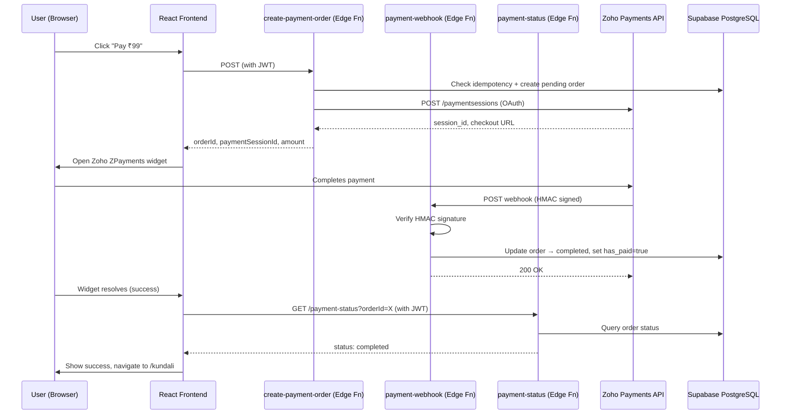

## Implementation Plan — Zoho Payments Integration for VedicFinance (via Supabase Edge Functions)

**Problem Statement:**
Replace the current simulated payment flow (localStorage + `Math.random()`) with a real Zoho Payments integration. The backend logic (order creation, webhook handling, status polling, OAuth token management) will run as Supabase Edge Functions (Deno). A successful ₹99 payment marks the user as paid in the `user_profiles` table, unlocking `/kundali`.

**Requirements:**
- Single product: ₹99 flat payment for Financial Kundali access
- No fee calculation or marketplace logic
- Payment status stored as `has_paid` in `user_profiles` (Supabase DB = source of truth)
- Replace all `hasPaid()` localStorage checks with Supabase-backed checks
- Zoho Payments widget (client-side SDK) for the payment UI
- Webhook + polling dual confirmation pattern
- HMAC signature verification on webhooks
- OAuth token auto-refresh for Zoho API calls
- Idempotency to prevent duplicate charges

**Background:**
- Frontend: Vite + React + TypeScript, uses `supabase.functions.invoke()` and direct `fetch` for edge function calls
- Backend: Supabase Edge Functions (Deno runtime, `serve()` pattern), shared CORS headers in `_shared/cors.ts`
- Auth: Supabase Auth with `useAuth()` context, session-based JWT
- Current payment page at `/payment` has UI components (`CheckoutShell`, `MethodStep`, `ProcessingStep`, `SuccessStep`, `FailedStep`) — these will be adapted
- Edge functions use `verify_jwt = false` in `config.toml` (JWT verified manually when needed)
- Zoho credentials are ready (Client ID, Secret, Refresh Token, Webhook Secret, Account ID)

**Architecture:**



**Proposed Solution:**

3 Supabase Edge Functions + 1 DB migration + frontend refactor:

| Component | Purpose |
|---|---|
| `supabase/functions/create-payment-order/index.ts` | Validates user, creates pending order in DB, calls Zoho to create checkout session, returns session ID |
| `supabase/functions/payment-webhook/index.ts` | Receives Zoho webhook, verifies HMAC, updates order + `has_paid` flag |
| `supabase/functions/payment-status/index.ts` | Returns order status from DB; if still pending, proactively syncs with Zoho API |
| `supabase/functions/_shared/zoho.ts` | Shared Zoho OAuth token management + API helpers |
| Migration `009_payment_orders.sql` | Adds `payment_orders` table + `has_paid` column to `user_profiles` |
| Frontend refactor | Replace `hasPaid()` localStorage with `usePaymentStatus()` hook backed by Supabase |

---

**Task Breakdown:**

**Task 1: Database migration — payment_orders table + has_paid column**

Objective: Create the database schema that supports the payment flow.

Implementation guidance:
- Create migration `supabase/migrations/009_payment_orders.sql`
- Add `has_paid boolean default false` column to `user_profiles`
- Create `payment_orders` table with columns: `id` (uuid PK), `order_id` (unique text, format "ORD-<uuid>"), `user_id` (uuid, references auth.users), `amount` (decimal 10,2), `currency` (text, default 'INR'), `status` (text, default 'pending' — values: pending/completed/failed/expired), `zoho_session_id` (text), `zoho_payment_id` (text), `idempotency_key` (text unique), `created_at`, `updated_at`, `expires_at`
- Create `webhook_events` table for idempotency: `id` (uuid PK), `event_id` (text unique), `event_type` (text), `order_id` (text), `processed_at` (timestamptz)
- RLS policies: users can read their own payment_orders; webhook edge function uses service_role key so it bypasses RLS
- Indexes on `payment_orders(user_id, status)` and `payment_orders(order_id)`

Test requirements:
- Verify migration runs without errors
- Verify RLS allows user to SELECT their own orders but not others'

Demo: Migration applied to Supabase, `has_paid` column visible on `user_profiles`, `payment_orders` table ready.

---

**Task 2: Shared Zoho service module (`_shared/zoho.ts`)**

Objective: Create a shared module for Zoho OAuth token refresh, checkout session creation, and session status retrieval — reusable across all payment edge functions.

Implementation guidance:
- Create `supabase/functions/_shared/zoho.ts`
- Implement `refreshAccessToken()`: calls `https://accounts.zoho.in/oauth/v2/token` with refresh_token grant, reads `ZOHO_CLIENT_ID`, `ZOHO_CLIENT_SECRET`, `ZOHO_REFRESH_TOKEN` from `Deno.env`
- Implement `getAccessToken()`: returns current token or refreshes if expired (use in-memory cache with expiry tracking)
- Implement `createCheckoutSession(params: { orderId, amount, currency, description })`: POST to `/api/v1/paymentsessions?account_id=X`, retries once on 401 (token expired)
- Implement `getPaymentSessionStatus(sessionId: string)`: GET `/api/v1/paymentsessions/{id}?account_id=X`
- Implement `verifyWebhookSignature(rawBody: Uint8Array, signatureHeader: string): boolean`: parse `t=` and `v=` from `X-Zoho-Webhook-Signature`, compute HMAC-SHA256 of `timestamp.body` with `ZOHO_WEBHOOK_SECRET`, constant-time compare
- All env vars: `ZOHO_CLIENT_ID`, `ZOHO_CLIENT_SECRET`, `ZOHO_REFRESH_TOKEN`, `ZOHO_WEBHOOK_SECRET`, `ZOHO_API_BASE` (default `https://payments.zoho.in/api/v1`), `ZOHO_ACCOUNT_ID`

Test requirements:
- Unit-test `verifyWebhookSignature` with known inputs (can be tested locally with `deno test`)
- Token refresh logic handles error responses gracefully

Demo: Module importable by edge functions, signature verification passes with test data.

---

**Task 3: `create-payment-order` edge function**

Objective: Authenticated endpoint that creates a payment order and returns a Zoho checkout session for the frontend widget.

Implementation guidance:
- Create `supabase/functions/create-payment-order/index.ts`
- Verify JWT from `Authorization` header (extract user_id from Supabase JWT using `supabase.auth.getUser()`)
- Check if user already `has_paid` — if yes, return early with `{ already_paid: true }`
- Generate idempotency key: SHA-256 of `user_id + "kundali" + minute_bucket` (prevents duplicate orders within same minute)
- Check if a pending order already exists for this idempotency key — if yes, return the existing session
- Insert a `payment_orders` row with status='pending', generate `order_id` as `"ORD-" + crypto.randomUUID()`
- Call `createCheckoutSession()` from `_shared/zoho.ts` with amount=99, currency='INR'
- Update the order row with `zoho_session_id`
- Return `{ orderId, paymentSessionId, amount: "99.00", currency: "INR" }`
- Add `[functions.create-payment-order]` entry to `supabase/config.toml` with `verify_jwt = false` (we verify manually)
- CORS headers for preflight

Test requirements:
- Returns 401 if no valid JWT
- Returns `already_paid: true` if user already paid
- Returns valid session data on success
- Idempotent: same request within minute returns same order

Demo: Frontend can call this function and receive a `paymentSessionId` to pass to the Zoho widget.

---

**Task 4: `payment-webhook` edge function**

Objective: Receive and process Zoho webhook events (payment.succeeded / payment.failed), update DB state.

Implementation guidance:
- Create `supabase/functions/payment-webhook/index.ts`
- NO JWT verification (Zoho can't send JWTs) — uses HMAC verification instead
- Read raw request body as `Uint8Array` (needed for HMAC)
- Extract `X-Zoho-Webhook-Signature` header, call `verifyWebhookSignature()`
- Return 401 immediately if signature invalid
- Parse JSON body, extract `event_type`, `event_object.payment.reference_number` (our order_id), `event_object.payment.payment_id`, `event_object.payment.amount`
- Idempotency: check `webhook_events` table for duplicate `event_id` — if exists, return 200 early
- Look up `payment_orders` by `order_id`
- On `payment.succeeded`:
  - Validate amount matches (±0.01 tolerance)
  - Update `payment_orders` set status='completed', zoho_payment_id
  - Update `user_profiles` set `has_paid=true` where id=user_id
  - Insert into `webhook_events`
- On `payment.failed`:
  - Update `payment_orders` set status='failed'
  - Insert into `webhook_events`
- Return 200 OK immediately (Zoho requires response within 5 seconds)
- Use `SUPABASE_SERVICE_ROLE_KEY` to bypass RLS for DB writes
- Add `[functions.payment-webhook]` to `config.toml` with `verify_jwt = false`

Test requirements:
- Invalid HMAC → 401
- Valid webhook with `payment.succeeded` → order status updated, `has_paid` set true
- Duplicate webhook (same event_id) → 200 OK, no duplicate processing
- Amount mismatch → logged/flagged but still returns 200

Demo: Manually POST a test webhook payload (with valid HMAC) → verify DB updates correctly.

---

**Task 5: `payment-status` edge function**

Objective: Polling endpoint for the frontend to check payment confirmation status, with active sync to Zoho if still pending.

Implementation guidance:
- Create `supabase/functions/payment-status/index.ts`
- Verify JWT (extract user_id)
- Accept query param `orderId`
- Query `payment_orders` where `order_id = orderId AND user_id = auth_user_id`
- If status is already 'completed' or 'failed', return immediately: `{ orderId, status, zohoPaymentId }`
- If status is 'pending' and `zoho_session_id` exists:
  - Call `getPaymentSessionStatus(zoho_session_id)` from `_shared/zoho.ts`
  - If Zoho says completed/succeeded/paid → update order to 'completed', set `has_paid=true` on user_profiles, return completed
  - If Zoho says failed/cancelled → update order to 'failed', return failed
  - Otherwise return pending
- Add `[functions.payment-status]` to `config.toml` with `verify_jwt = false`

Test requirements:
- Returns 401 without JWT
- Returns current status for user's order
- Syncs with Zoho when pending and updates DB

Demo: After a payment completes, calling this endpoint returns `status: "completed"`.

---

**Task 6: Frontend — Zoho SDK loading + payment service module**

Objective: Load the Zoho Payments JS SDK and create a service module that orchestrates the payment flow.

Implementation guidance:
- Add Zoho SDK script tag to `index.html`: `<script src="https://payments.zoho.in/jslib/zpayments.js" defer></script>`
- Create `src/lib/zoho-payments.ts`:
  - `createZohoInstance()`: initializes `new ZPayments({ account_id, domain: 'IN', otherOptions: { api_key } })` — reads from `VITE_ZOHO_ACCOUNT_ID` and `VITE_ZOHO_API_KEY`
  - `openPaymentWidget(sessionId, amount, orderId)`: calls `instance.requestPaymentMethod(options)`, handles `widget_closed` error code
  - TypeScript declarations for the `ZPayments` global
- Create `src/lib/payment-api.ts`:
  - `createPaymentOrder()`: calls `supabase.functions.invoke("create-payment-order")`, returns `{ orderId, paymentSessionId, amount }`
  - `pollPaymentStatus(orderId)`: implements exponential backoff polling (max 15 attempts, 2s initial, 1.5x backoff, 2 min timeout), calls `supabase.functions.invoke("payment-status", { body: { orderId } })`
- Add env vars to `.env.example`: `VITE_ZOHO_ACCOUNT_ID`, `VITE_ZOHO_API_KEY`

Test requirements:
- `createZohoInstance` returns null gracefully when SDK not loaded
- Polling stops when status is non-pending
- Polling respects timeout

Demo: SDK loads without errors; `createPaymentOrder()` returns session data from the edge function.

---

**Task 7: Frontend — usePaymentStatus hook (replace localStorage)**

Objective: Replace all `hasPaid()` localStorage calls with a Supabase-backed `usePaymentStatus()` hook.

Implementation guidance:
- Create `src/hooks/usePaymentStatus.ts`:
  - Queries `user_profiles.has_paid` for the current user via `supabase.from("user_profiles").select("has_paid").eq("id", user.id).single()`
  - Returns `{ hasPaid: boolean, loading: boolean, refetch: () => void }`
  - Uses `@tanstack/react-query` for caching (stale time: 30s, cache time: 5 min)
  - Returns `hasPaid: false` if no user is logged in
- Update `src/pages/AuthPage.tsx`: replace `hasPaid()` with the hook or a direct query
- Update `src/pages/Landing.tsx`: replace `hasPaid()` with the hook
- Update `src/components/landing/Navbar.tsx`: replace `hasPaid()` with the hook
- Keep `src/lib/payment-storage.ts` temporarily (for the processing/success/failed UI state during checkout), but `hasPaid()` is no longer the source of truth for access control
- Update `ProtectedRoute` or create a `PaidRoute` wrapper for `/kundali` that checks `has_paid` from the DB

Test requirements:
- Hook returns `loading: true` initially, then resolves
- Hook returns `hasPaid: false` for new users
- Hook returns `hasPaid: true` after payment succeeds and refetch is called
- `/kundali` route redirects to `/payment` if user hasn't paid

Demo: A new user sees the payment gate. A paid user goes directly to `/kundali`.

---

**Task 8: Frontend — Rewire Payment.tsx to use real Zoho flow**

Objective: Replace the simulated `setTimeout` + `Math.random()` payment with the real Zoho widget flow.

Implementation guidance:
- Rewrite `src/pages/Payment.tsx`:
  - On "Pay ₹99" click: call `createPaymentOrder()` → open Zoho widget with `openPaymentWidget(sessionId, amount, orderId)` → on widget success, navigate to confirmation/polling state → poll `pollPaymentStatus(orderId)` → show success/failed/timeout
  - Handle `widget_closed` (user cancelled) gracefully
  - Handle browser back button (push dummy history entry before opening widget)
  - Keep the existing UI components (`CheckoutShell`, `ProcessingStep`, `SuccessStep`, `FailedStep`) but wire them to real data
  - Remove the `MethodStep` component from the flow (Zoho widget handles method selection) OR keep it as a pre-step that shows the amount summary before opening the widget
- Update `SuccessStep` to show the real `orderId` and `zohoPaymentId`
- After successful payment confirmation, call `refetch()` on the `usePaymentStatus` hook to update the cached state
- Save the `orderId` to `localStorage` so page refreshes during polling can resume

Test requirements:
- Happy path: order created → widget opens → payment succeeds → polling confirms → success shown
- Widget closed: returns to method selection, no error toast
- Polling timeout: shows timeout state with order ID and support info
- Page refresh during polling: resumes polling

Demo: End-to-end payment flow with the Zoho widget, real money (test mode), confirmation shown.

---

**Task 9: Environment variables + config.toml + deployment checklist**

Objective: Wire all environment variables for both local dev and production, update Supabase config.

Implementation guidance:
- Update `.env.example` with all new vars:
  - Frontend: `VITE_ZOHO_ACCOUNT_ID`, `VITE_ZOHO_API_KEY`
  - Edge Functions (set in Supabase dashboard > Edge Functions > Secrets): `ZOHO_CLIENT_ID`, `ZOHO_CLIENT_SECRET`, `ZOHO_REFRESH_TOKEN`, `ZOHO_WEBHOOK_SECRET`, `ZOHO_API_BASE`, `ZOHO_ACCOUNT_ID`, `FRONTEND_URL`
- Update `supabase/config.toml` with entries for all 3 new functions (verify_jwt = false)
- Document the webhook URL format: `https://<project-ref>.supabase.co/functions/v1/payment-webhook`
- Add a `PAYMENT_INTEGRATION.md` documenting:
  - How to configure Zoho dashboard (webhook URL, events to subscribe)
  - Environment variable reference
  - Payment flow diagram
  - Troubleshooting (token refresh failure, webhook not received, etc.)

Test requirements:
- All edge functions deploy successfully to Supabase
- Zoho webhook configured and test ping succeeds
- Frontend loads Zoho SDK without console errors

Demo: Full deployment working — Zoho dashboard configured, webhook receiving events, frontend making real payments in test mode.

---

**Task 10: Payment order expiry cleanup + edge cases**

Objective: Handle stale pending orders and edge cases for production robustness.

Implementation guidance:
- Add a Supabase scheduled function (pg_cron or a separate edge function triggered by cron) that marks orders as 'expired' if `status='pending' AND created_at < now() - interval '30 minutes'`
- Alternatively, use a PostgreSQL function + pg_cron extension:
  ```sql
  SELECT cron.schedule('expire-pending-orders', '*/10 * * * *',
    $$UPDATE payment_orders SET status='expired', updated_at=now()
      WHERE status='pending' AND expires_at < now()$$);
  ```
- Handle edge case: user pays but webhook arrives late → polling endpoint syncs with Zoho and confirms
- Handle edge case: user has a pending expired order and tries to pay again → new order created (idempotency key uses minute bucket, so a new attempt gets a new key)
- Add `updated_at` trigger on `payment_orders` (auto-update on any modification)

Test requirements:
- Orders older than 30 minutes get marked expired
- User can retry payment after an expired order
- No duplicate `has_paid=true` writes (idempotent)

Demo: Stale orders auto-expire; retrying after expiry creates a fresh order and completes successfully.

---